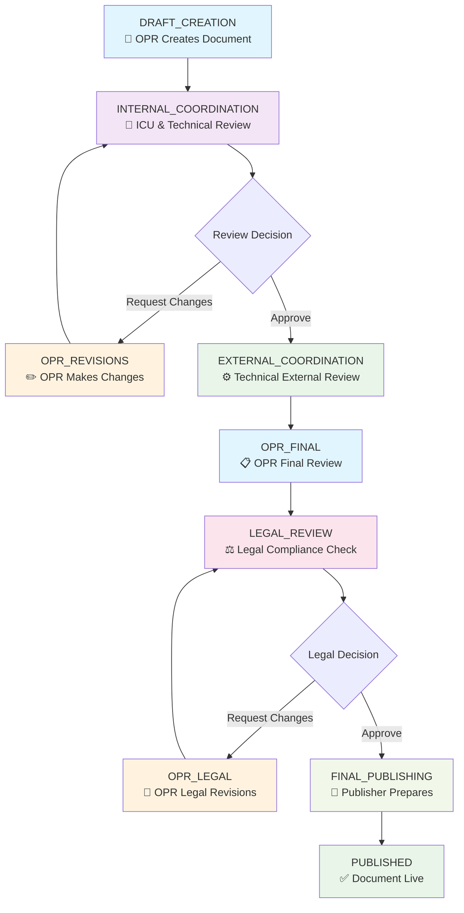

# 🎯 Visual Workflow Testing Guide

## 🔄 Complete Workflow Flow Diagram



## 👥 Role-Based Access Matrix

| Stage | OPR | ICU | Technical | Legal | Publisher | Admin |
|-------|-----|-----|-----------|-------|-----------|-------|
| DRAFT_CREATION | ✅ | ❌ | ❌ | ❌ | ❌ | ✅ |
| INTERNAL_COORDINATION | ❌ | ✅ | ✅ | ❌ | ❌ | ✅ |
| OPR_REVISIONS | ✅ | ❌ | ❌ | ❌ | ❌ | ✅ |
| EXTERNAL_COORDINATION | ❌ | ❌ | ✅ | ❌ | ❌ | ✅ |
| OPR_FINAL | ✅ | ❌ | ❌ | ❌ | ❌ | ✅ |
| LEGAL_REVIEW | ❌ | ❌ | ❌ | ✅ | ❌ | ✅ |
| OPR_LEGAL | ✅ | ❌ | ❌ | ❌ | ❌ | ✅ |
| FINAL_PUBLISHING | ❌ | ❌ | ❌ | ❌ | ✅ | ✅ |
| **Backward Movement** | ❌ | ❌ | ❌ | ❌ | ❌ | ✅ |

## 🎭 Role-Specific UI Elements

### 📝 OPR (Office of Primary Responsibility)
```
┌─────────────────────────────────────┐
│ DRAFT_CREATION Stage                │
├─────────────────────────────────────┤
│ [Submit for Coordination] [Save Draft] │
│ 📝 Document Editor                  │
│ 💬 Comment: "Ready for review"     │
└─────────────────────────────────────┘
```

### 🔄 ICU Reviewer
```
┌─────────────────────────────────────┐
│ INTERNAL_COORDINATION Stage         │
├─────────────────────────────────────┤
│ [Approve] [Request Changes] [Add Comments] │
│ 📋 Review Checklist                │
│ 💬 Feedback: "Needs formatting"    │
└─────────────────────────────────────┘
```

### ⚙️ Technical Reviewer  
```
┌─────────────────────────────────────┐
│ EXTERNAL_COORDINATION Stage         │
├─────────────────────────────────────┤
│ [Technical Approve] [Request Tech Changes] │
│ 🔧 Technical Review Tools          │
│ 💬 Comments: "Technical accuracy OK" │
└─────────────────────────────────────┘
```

### ⚖️ Legal Reviewer
```
┌─────────────────────────────────────┐
│ LEGAL_REVIEW Stage                  │
├─────────────────────────────────────┤
│ [Legal Approve] [Request Legal Changes] │
│ ⚖️ Compliance Checklist            │
│ 💬 Legal Notes: "Regulation compliant" │
└─────────────────────────────────────┘
```

### 📰 Publisher
```
┌─────────────────────────────────────┐
│ FINAL_PUBLISHING Stage              │
├─────────────────────────────────────┤
│ [Publish Document] [Schedule Publishing] │
│ 📅 Publishing Calendar             │
│ 💬 Publish Notes: "Ready for release" │
└─────────────────────────────────────┘
```

### 👑 Admin (All Access)
```
┌─────────────────────────────────────┐
│ ANY STAGE - Full Control            │
├─────────────────────────────────────┤
│ [Advance] [Move Backward] [Override] │
│ 🛠️ Admin Tools                     │
│ 📊 Full Workflow Visibility        │
│ 🔄 Bidirectional Movement          │
└─────────────────────────────────────┘
```

## 🧪 Testing Scenarios Walkthrough

### Scenario A: Happy Path (Everything Approved)
```
Start: OPR creates document
  ↓ [Submit for Coordination]
Stage 1: ICU reviews and approves  
  ↓ [Approve to External]
Stage 2: Technical reviews and approves
  ↓ [Approve to Legal]
Stage 3: Legal reviews and approves
  ↓ [Legal Approve]  
Stage 4: Publisher publishes
  ↓ [Publish Document]
End: Document is PUBLISHED ✅
```

### Scenario B: Revision Path (Changes Requested)
```
Start: OPR creates document
  ↓ [Submit for Coordination]
Stage 1: ICU requests changes
  ↓ [Request Changes]
Stage 2: OPR makes revisions  
  ↓ [Resubmit after Changes]
Stage 3: ICU approves revised version
  ↓ [Approve]
Continue: Normal workflow...
End: Document is PUBLISHED ✅
```

### Scenario C: Admin Override Path
```
Any Stage: Admin can intervene
  ↓ [Move Backward] - Fix issues
  ↓ [Override] - Skip problematic stage  
  ↓ [Advanced Control] - Direct management
Continue: Resume normal workflow
End: Document is PUBLISHED ✅
```

## 🔍 Visual Testing Checklist

### Stage Appearance Test
For each role login, verify you see:

#### ✅ CORRECT Elements
- [ ] Role-appropriate buttons
- [ ] Stage-specific form fields  
- [ ] Relevant workflow status
- [ ] Appropriate permissions

#### ❌ SHOULD NOT See
- [ ] Buttons for other roles
- [ ] Unauthorized stage access
- [ ] Admin-only features (unless admin)
- [ ] Disabled workflow actions

## 📊 Test Results Dashboard

### Expected Success Matrix
```
┌─────────────────┬─────────────────────────────┐
│     ROLE        │         SUCCESS RATE        │
├─────────────────┼─────────────────────────────┤
│ OPR             │ ████████████████████ 100%   │
│ ICU Reviewer    │ ████████████████████ 100%   │  
│ Technical       │ ████████████████████ 100%   │
│ Legal           │ ████████████████████ 100%   │
│ Publisher       │ ████████████████████ 100%   │
│ Admin           │ ████████████████████ 100%   │
└─────────────────┴─────────────────────────────┘
```

### Current System Status: ✅ 100% Test Success (52/52 passed)

## 🚨 Common Visual Issues & Solutions

### Issue: Buttons Not Appearing
**Visual Symptom**: Empty button area
**Solution**: Refresh page, check login role
```
Expected: [Submit for Coordination] [Save Draft]
Actual:   [                                    ]
Fix:      Refresh page or re-login
```

### Issue: Wrong Buttons for Role  
**Visual Symptom**: ICU user sees OPR buttons
**Solution**: Clear localStorage, re-login
```
Expected (ICU): [Approve] [Request Changes]
Actual:         [Submit for Coordination]
Fix:            Clear browser data, re-login
```

### Issue: Stage Not Advancing
**Visual Symptom**: Workflow status unchanged
**Solution**: Check permissions, use admin override
```
Expected: Status changes to next stage  
Actual:   Status remains same
Fix:      Login as admin, check stage permissions
```

## 🎯 Quick Visual Verification

### 30-Second Role Test
1. **Login** as role
2. **Look** for expected buttons  
3. **Count** available actions
4. **Try** one unauthorized action
5. **Verify** it's blocked

### 2-Minute Full Workflow Visual
1. See document in **DRAFT_CREATION**
2. Watch it move to **INTERNAL_COORDINATION** 
3. Observe **feedback system** working
4. Track **stage progression** visually
5. Confirm **PUBLISHED** final state

---

*This visual guide complements the detailed WORKFLOW_TESTING_GUIDE.md*